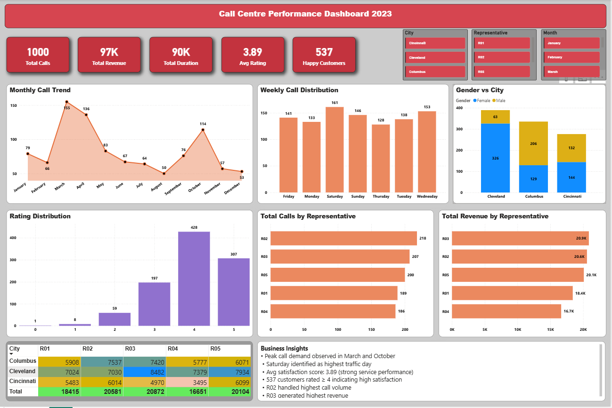

# Call Centre Performance Dashboard (Power BI)

## Project Overview
This project presents an interactive Power BI dashboard analyzing call centre operations across customer satisfaction, revenue generation, workload distribution, and regional performance.

The dashboard enables business stakeholders to monitor representative productivity, identify demand trends, and improve service efficiency.

## Key Metrics
- Total Calls: 1,000
- Total Revenue: 97K
- Total Duration: 90K minutes
- Average Satisfaction Rating: 3.89
- Happy Customers: 537

## Key Insights
- Peak call demand observed in March and October
- Saturday recorded highest call traffic
- Majority of customers rated service 4 or above
- Representative R02 handled highest call volume
- Representative R03 generated highest revenue
- Cleveland recorded highest regional demand

## Features
- Monthly call trend analysis
- Weekly workload distribution
- Customer satisfaction segmentation
- Representative-level performance tracking
- City-wise service demand comparison
- Interactive slicers for filtering by city, representative, and month

## Tools Used
- Power BI
- Data Modeling
- DAX Measures
- Interactive Visualizations

## Dashboard Preview

